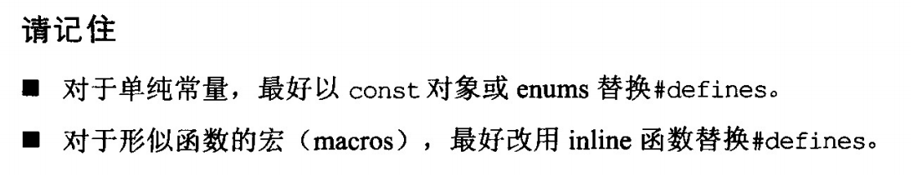

_ _ _
## 引言

### 基本但需明确的定义

| 序号 | 内容 |
|--------|--------|
|1| **声明式**： 只是告诉编译器对象的名称和类型。但略去细节，即为发生内存分配和赋初值。|
|   2   | **size_t**. size_t是C++计算个数时用的某种不带正负号（unsigned）类型。它被用于基于字符指针的字符串数组内表示字符的个数，也被用于vector,deque,string等STL哦容器的operator[] 函数所接受的参数类型。      |
|3| **函数签名**：函数的声明揭示其签名式，也就是函数的返回类型和参数类型。函数的签名也就是函数的类型。|
|4|**定义式**：提供编译器一些声明式所遗漏的细节。对对象来说，定义式是编译器为对象拨发内存。对于函数，函数模板来说，定义式提供代码本体。对于类和类模板来说，定义式列出它们的成员。|
|5|**初始化**：给予对象初值的过程。对于自定义类型，调用构造函数。默认构造函数要么没有参数，要不全部参数都有缺省值。|
|6|**构造函数的explicit声明**：防止调用构造函数时发生隐式类型转换，这样增加用户不可控的风险。使之必须显式类型转换才行。|
|7|**拷贝构造函数和拷贝赋值运算符重载**：在带有指针成员的类，必须给出自定义的拷贝构造函数和拷贝赋值运算符重载函数，因为编译器提供的默认版本不能对指针申请的内存有效释放，造成内存泄漏。注意：区分两者的关键在于看有无新对象被定义。`Widget w3 = w2;`调用的是拷贝构造函数，=语言也可以用来调用拷贝构造函数；在传参pass by value时，会调用拷贝构造函数，所以拷贝构造函数的参数应该声明为引用类型，否则在传参时陷入无限调用拷贝构造函数的死循环中，最终内存溢出。两者都返回引用类型。在拷贝赋值运算符重载函数的定义中，要先检查有无自赋值的情况，`if(this == &param) return *this;`,然后先释放指针指向的旧内存，再申请新内存，拷贝内容。|
|8|**不确定性行为**：空指针解引用，数组超出索引在C++中会导致的是不确定的行为，这与其他程不同。意味着，有时会正常，有时会崩溃，有时产生不正确的结果。|
|9|接口：C++中没有明确的接口概念。书中的接口是指函数签名或者是class中可访问的元素（pubic接口，protected接口，private接口）|

### 条款1 视C++为一个语言联邦
包含4个次语言
- C -局限：没有模板，异常，重载...
- Objected-Oriented C++
- Template C++
- STL

所遵循的守则在每个次语言不一定都一致。

### 条款2 尽量以const, enum, inline替换 #define
宁以编译器替换预处理器

| 序号 | 内容 |
|--------|--------|
|   1     | `#define ASPECT_RATIO 1.653` -> `const double AspectRatio = 1.653` 原因ASPECT_RATIO可能因为没进入符号表造成编译错误，此时错误指示的是1.653而非ASPECT_RATIO，造成调试错误也相当麻烦。后者因为是变量（常量），肯定会进入符号表，且产生的代码量也比前者小。|
|1.1|在1中，如果是常量指针（区别于指针所指之物是常量），定义为`const char* const authorName = "Scott Meyers"`,更推荐使用string而非char*-based字符串，`const std::string authorName("Scott Meyers")`|
|1.2|在1中，class的专属常量，应定为` static const int Numbers = 5;` static确保常量只有一个实体，且static和const的位置前后随意。注意：这只是一个声明式，即便同时给出了初值。要在实现文件中给出定义式， `const int Object::Numbers;` 此时才发生内存的分配。如果没有定义式，则可以使用，但是不能出现取该变量地址的操作，否则会报错。最后，在声明时已经给出初值，所以在定义式中不能再设初值。总的来说，希望通过这个例子，弄明白声明，定义，赋初值间的关系。旧的编译器可能不支持static成员在声明式上获得初值，此时应该在定义式上赋初值。|
|1.2.1|万一编译器不允许static成员常量在声明时完成in class初值设定，而这个初始值又用来在编译时声明一个数组，编译器在编译时期必须知道数组的大小（非new）,造成失败。此时，可以使用“the enum hack”，其理论基础：一个枚举类型的数值可权充int被使用。-> `enum {Numbers = 5}; //令Numbers成为5的一个记号名称。int scores(Numbers);`|
|1.3|#define不重视作用域，一旦宏被定义，在其后的编译过程都有效，除非某处#undef。也不能提供任何封装性。所以#define不能用来定义class的专属常量。|

### 条款3 尽可能使用const

