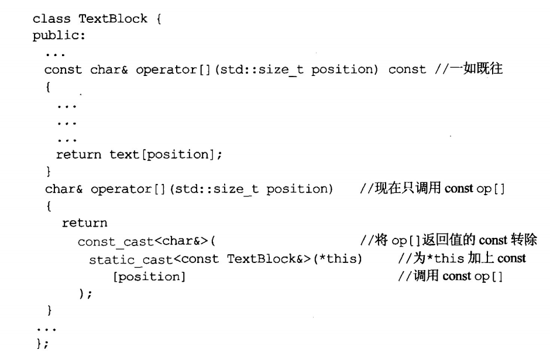

### 条款3 尽可能使用const
const关键字允许指定一个语义约束，即一个不可改动的对象，而编译器会强制实施这个约束。

| 序号 | 内容 |
|--------|--------|
|    1    |   区分指向常量的指针和指针常量。`char greeting[] = "hello"; //指向常量的指针 const char* p = greeting; //常量指针 char* const p = greeting; //指向常量的常量指针 const char* const p = greeting;` 关键字const出现在星号左边，表示被指物常量，如果出现在星号右边，表示指针自身是常量。如果出现在星号两边，表示被指物和指针两者都是常量。如果被指物是常量，则关键字const写在类型之前或之后，星号之前，两者写法的意义相同。`const Widget* pw vs Widget const * pw`|
|2|STL迭代器以指针为根据塑模出来，所以迭代器的作用就像个T*指针。声明迭代器为const，就像声明指针为const一样，即迭代器不能再指向别的东西，但是指向的东西的值可以被改变。如果希望指向的东西的值不可改变，则需要要const_iterator.示例：`const std::vector<int>::iterator iter = vec.begin();`//表示迭代器不能再指向别的东西，即 T&#10052; const。 `std::vector<int>::iterator cIter = vec.begin();`//迭代器指向对象的内容不可改变，即const T&#10052;。|
|3|const最具威力的用法：与函数声明的连用。可以与返回值，各参数，函数自身（成员函数）相关联。**总之，除非你有需要改动参数或local对象，否则请将它们声明为const**。1.给函数返回值声明为const, 意味着函数返回值不能再修改，可以防止错误使用=，一是if(fun(a) = b)的书写错误，甚至出现隐式类型变换转为bool,使错误更难发现,二是（a*b）=c，a&#10052;b是operator*函数，=会调用operator=。|
|4|const用于成员函数，即表示函数内不能修改对象的数据成员。声明为const就可以很清楚的知道，哪些函数可以改动对象内容，哪些不可以。第二，使得操作const对象称为可能。因为const对象不允许修改内容，如果想用引用的方式传参，则不能修改函数参数。|
|5|mutable(可变的)释放掉non-static成员变量的bitwise constness约束。即，在维护对象不可变的整体效果下（客户的角度），允许修改一些不重要的变量，让编译器能够接受。|
|6|注意返回值的方式，是by-value还是by-reference。在operator[]函数，如果定义返回是by-value，就会出现arr[i]=1;修改的是副本，而非arr对象。|
|7|如果两个成员函数只是常量性不同，它们符合函数重载的条件。意味着编译器会根据调用时的常量性选择合适的函数。|
|8|常量性移除：令non-const成员函数调用其const兄弟是避免代码重复的安全做法。需要执行一个转型动作。|

### 建议此条款反复阅读
